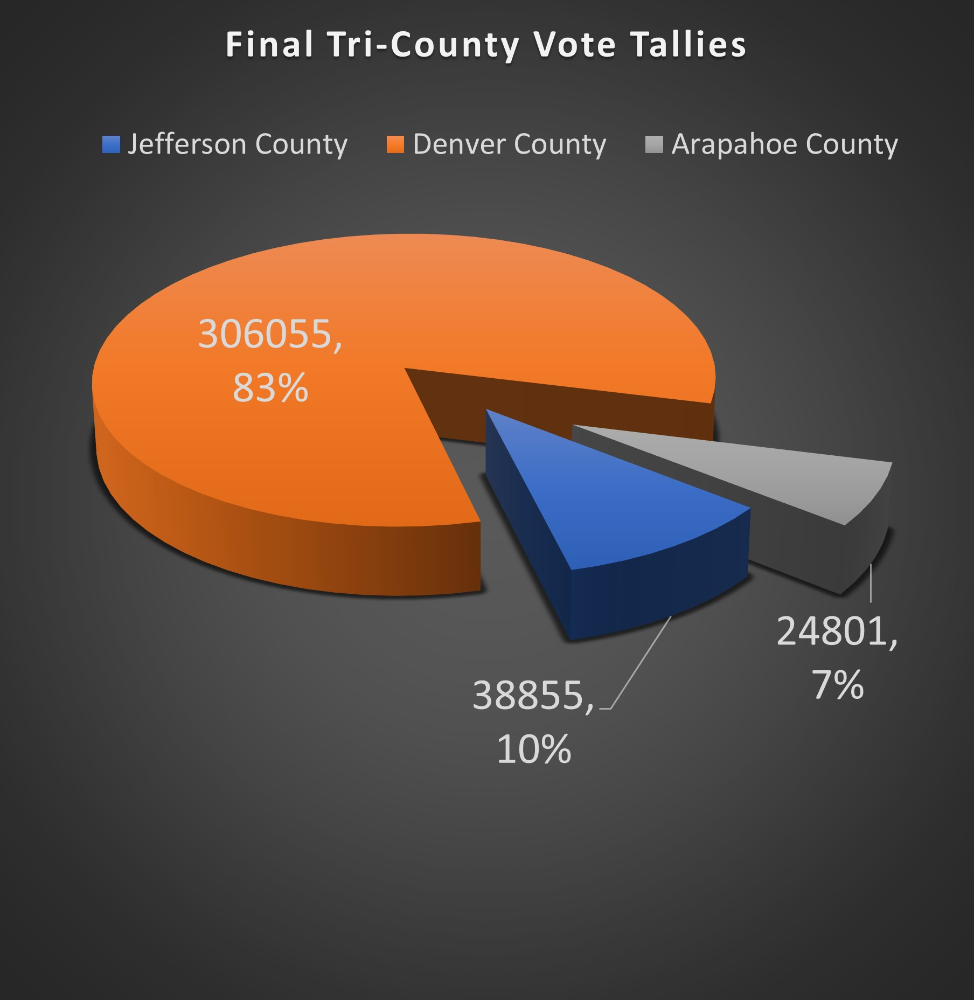

# Denver-Jefferson-Arapahoe Tri-County Election Supplementary Analysis
## An analysis of election balloting results across three counties.
### Richard E Barber 2021

#### Overview of Election Audit

The purpose of this election analysis audit is to provide additionally requested information regarding election audit results from the Denver-Jefferson-Arapahoe Tri-County area.

#### Election Audit Results

</img>
* point one
* point two
* poin three

#### Election Audit Summary

There is a statement to the election commission that explores how this script can be used for any election, with two examples for modifying the script. (4 pt)

1) mod 1
2) mod 2
