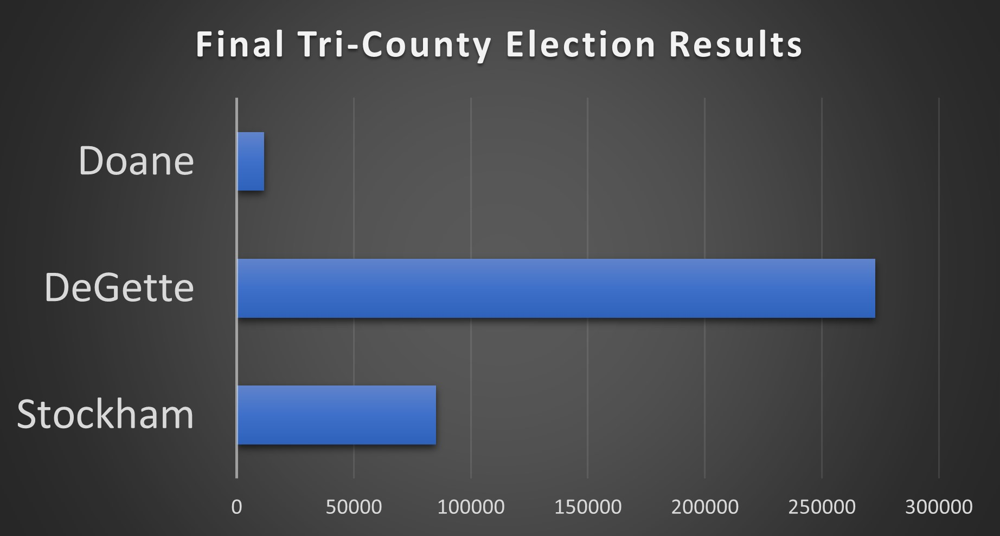

# Denver-Jefferson-Arapahoe Tri-County Election Supplementary Analysis
## An analysis of election balloting results across three counties.
### Richard E Barber 2021

#### Overview of Election Audit

The purpose of this election analysis audit is to provide additionally requested information regarding election audit results from the Denver-Jefferson-Arapahoe Tri-County area.

#### Election Audit Results

</img>
* Of the three counties, Denver County had the highest voting tally, representing 83% of the Tri-County vote.
</img>
* The clear winner among voters in the Tri-County Area was Diana DeGette, who with 272,892 votes garnered 73.8% of the Tri-County vote.
* Candidates Stockham and Doane came in second and third with 23% and 3.1% of the vote, repectively.

#### Election Audit Summary

This script may be easily adapted to suit any election. Here are some examples of ways the script may be modified in order to make the script more universal and add additional features.

1) The script could be expanded to include all the counties of the state.
2) The script could be modified to handle election results per census tract.
